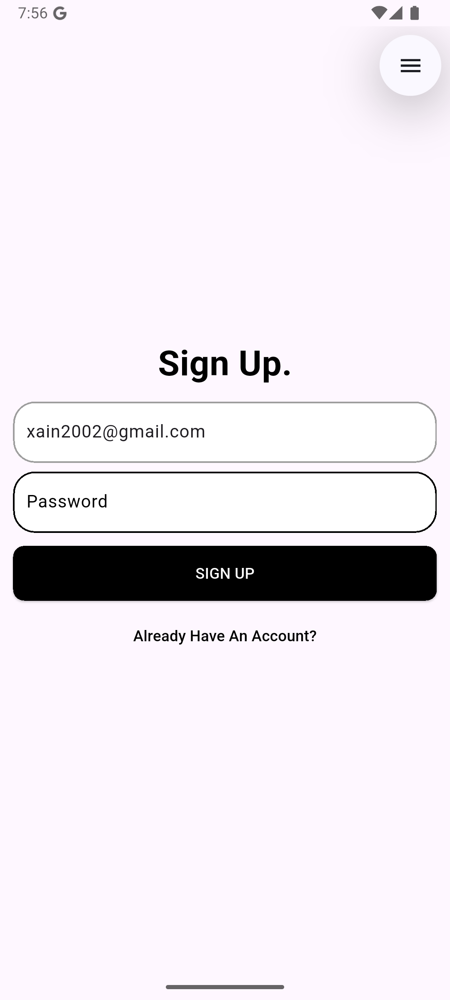

# Firebase Firestore App 📋

A simple Flutter app demonstrating **Firebase Firestore** integration with **Email & Password Authentication** and full **CRUD operations** for task management.

## Features ✨

- 🔐 Email & Password Sign Up & Sign In
- 🔁 Auth State Persistence
- 📝 Create Task (via Floating Action Button)
- 🛠️ Update Task (via tap)
- ❌ Delete Task (via swipe)
- 📆 Date Picker for Task Deadlines
- 🖼️ Image Picker (Gallery)

## Screenshots 📸

### **Sign Up Page**
> The sign-up screen allows users to register using their email and password. Simple form fields ensure quick onboarding.
<p>



<p>

### **Sign In Page**
> The login screen provides access to registered users. It includes form validation and a responsive layout.
<p>

<p>

### **Home Page**
> After signing in, users land on the home page, which displays a list of all their tasks fetched from Firestore in real time. Each task item includes a title, description, date, and optional image.

<p>

<p>

### **Add New Task**
> Tapping the floating action button (FAB) opens a modal bottom sheet. Users can enter task details including title, description, pick a deadline using a date picker, and optionally choose an image from their device's gallery.

<p>


<p>

### **Update Existing Task**
> Tapping on any task item opens the same bottom sheet used for adding, now prefilled with the task data. Users can edit and save the changes, which update the Firestore document in real time.
<p>


<p>

### **Delete Task**
> Users can delete a task by swiping it left or right. This action triggers a Firestore document deletion, and the task is removed from the list instantly.
<p>


<p>

## Dependencies ⚙️

This project uses:
- [`firebase_core`](https://pub.dev/packages/firebase_core): Required for initializing Firebase in your Flutter app.
- [`firebase_auth`](https://pub.dev/packages/firebase_auth): Firebase Authentication SDK to implement various sign-in methods.
- [`cloud_firestore`](https://pub.dev/packages/cloud_firestore): A flexible, scalable NoSQL cloud database to store and sync data in real time for all connected clients.
- [`image_picker`](https://pub.dev/packages/image_picker): Allows users to pick images from their device gallery or camera, used here to optionally attach images to tasks.
- [`uuid`](https://pub.dev/packages/uuid): Generates unique identifiers (UUIDs), useful for assigning unique IDs to tasks or documents in Firestore.
- [`flutter_dotenv`](https://pub.dev/packages/flutter_dotenv): Used to load environment variables from a `.env` file.

## Getting Started 🛠️

### Firebase Setup

1. Go to [Firebase Console](https://console.firebase.google.com) and create a project.
2. Enable **Email/Password** under **Authentication → Sign-in method**.
3. Enable **Cloud Firestore** in Build > Firestore Database.
4. Add your Android/iOS app and download `google-services.json` or `GoogleService-Info.plist`.
5. Place the config file in your app's respective folder.

### Clone and Run

```bash
git clone https://github.com/muhammadXainAhmad/firebase_firestore_app.git
cd firebase_firestore_app
flutter pub get
flutter run
```

## Tech Stack 🛠️

- **Flutter**: UI toolkit for building natively compiled applications for mobile from a single codebase.
- **Dart**: The programming language used to develop Flutter applications.
- **Firebase Auth**: Provides backend services for easy use of authentication with multiple methods.
- **Firebase Firestore**: Cloud NoSQL database for storing and syncing app data in real time.
- **Flutter Dotenv**: Manages environment variables securely.
- **VS Code / Android Studio**: IDEs used for Flutter development.
- **Git**: Version control system for tracking changes in source code.

## License 📄
This project is licensed under the [MIT License](LICENSE).